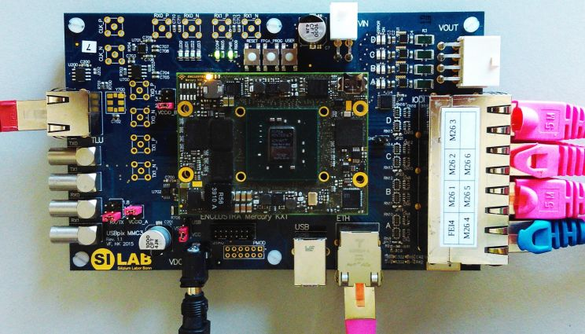

# pyBAR firmware for [Mimosa pixel telescope](https://telescopes.desy.de/)

Allows continuous full configuation and data taking for single FE-I4 trigger plane and six MIMOSA26 planes. Includes JTAG, TLU and TDC modules.

The MMC3 board is based on [Enclustra Mercury KX1](http://www.enclustra.com/en/products/fpga-modules/mercury-kx1/) module.
The Firmware make use of [Basil](https://github.com/SiLab-Bonn/basil) framework and free [SiTcp](http://sitcp.bbtech.co.jp/) Ethernet module (v08).




## Hardware

* Enclustra Mercury KX1 plus carrier board
* powering via USB or 5V power supply due to jumper configuration
* Jumpers for RJ45 ports on the carrier board, see pictures
* Bonn cables: The original firmware is written to use the Mimosa pin assignment on the AUX board side and the standard Ethernet pn assignment on the MMC3 side. Thus, modified cables has to be used: Swap only on one side only Pin 4 and 6.
* attached heatsink to FPGA chip
    * temperature w/o heatsink:  °C (stand-by), °C (programmed)
    * temperature with heatsink:  °C (stand-by), °C (programmed)

## Firmware

* basil and pyBAR
* SiTCP v08
* generated bitfiles in ```bitfiles/```
    * ```170904_mmc3_m26_ip22subnet.bit```
    * ```170931_mmc3_m26_eth_default.bit```

## Software

* Hardware Layers: Basil
    * fixed bug in ```basil/TL/SiTcp.py```, line 96: ```logging.warning("SiTcp:write - Invalid address %d" % hex(addr))``` has to be string wildcard ```%s```
* DAQ: pyBAR
* Interpretation: ```pyBAR_mimosa26_interpreter```

## Example

* upload bitfile (Vivado plus JTAG module)
* adjust configuration yaml-files
* running scan: ```python scan_telescope_m26.py```

## ToDo and to test:

- [ ] using QSPI flash for autoamtic bitfile-upload (incl. possible resistor modification of FPGA carrier board)
- [ ] JTAGging of Mimosa26 (incl. only for one sensor w/o JTAG distr. board)
- [ ] read-out of Agilent power supply
- [ ] understanding: Basil hardware layer, yaml configuration and pybar software usage
- [ ] testing ```testbeam_analysis``` 
